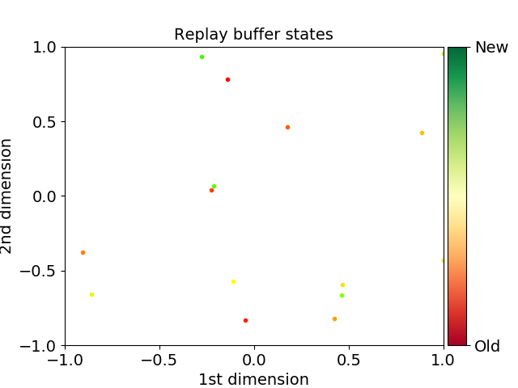
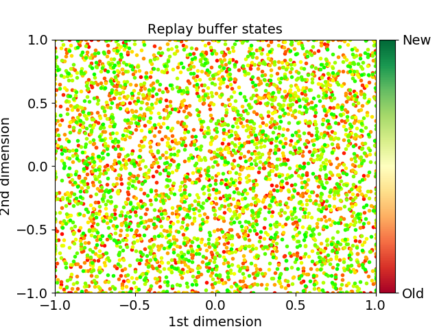
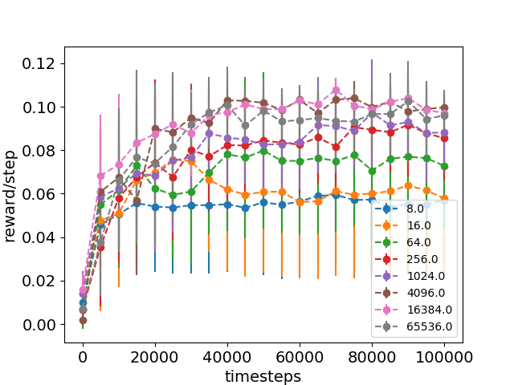
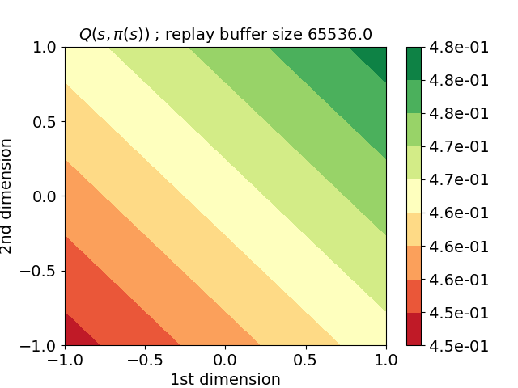
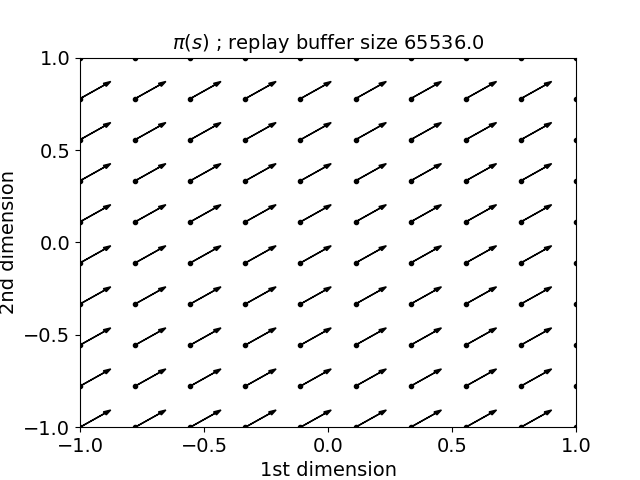
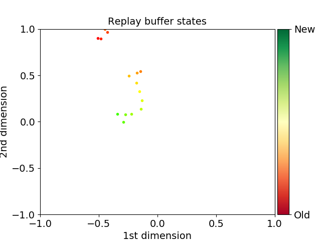
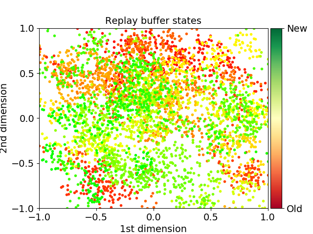
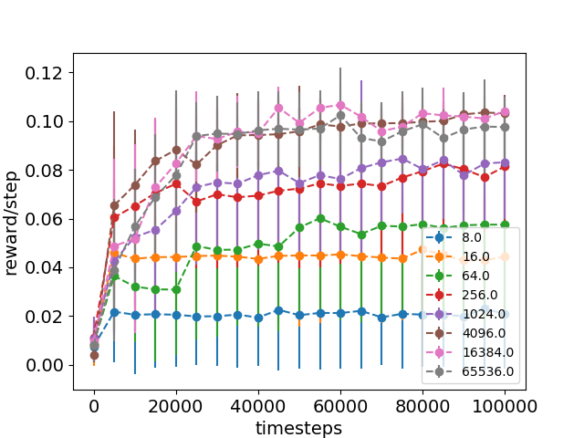
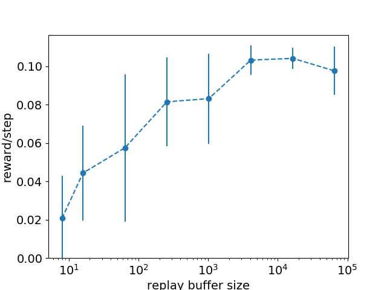

# Study 1: Score according to the replay buffer size

In this study we analyze the influence of the replay buffer size on the average reward. We train DDPG during 40k timesteps, with a replay buffer size ranging from $4^{2}$ to $4^{8}$. The environment is 2 dimensional with high rewards present on the top and right edges and low rewards on the opposite sides. We perform these training as batch learning, meaning that the replay buffer is filled before the beginning of the training and DDPG is not allowed to push any new experience into the replay buffer. Making the exploration phase the only source of information on the environment. So it is important to choose how to proceed to this exploration. We decided to test the two common ways to do this, the first one, uniform exploration consist in drawing an initial state from a uniform distribution, then an action is sampled from another uniform distribution over the action space. The full experience is then created when applying the sampled action on the initial state. On each iteration the whole process restart. the second exploration scheme is a random walk where an initial state and an action are sampled as in the uniform exploration. However, any subsequent step will have the previous resulting state in place of its initial state.

We expect to see poor performance on the lower replay buffers sizes, as the number of experiences that can be contained in the replay buffer is too low , leading to an almost certain auto correlation of the experiences when sampling from the replay buffer. As the replay buffer size increases , the performance should rise and settle to a level dependant of the environment. In our 2D environment , the starting position greatly influence the outcome and therefore the average reward obtained. We forced the starting point to be uniformly generated around the center point of the environment in a hyper sphere with a radius of 0.1 in order to reduce the variance that would otherwise be induced.

## Uniform sampled replay buffer

 |  | 
:--------------:|:------------------:|:-----------------:

Figure \ref{fig:buffers_uniform} represents replay buffers examples of our 2D environment \ref{fig:2d_2_env}. The visualisations shows the initial position for each experience contained, and the color form the red to the green means from the oldest to newest experience, this information is not important for a replay buffer filled by uniform exploration, however for replay buffers filled with random walk it allow us to follow the path taken by the agent during the exploration phase.

 | 
:---------------:|:------------------:

Figure \ref{fig:scores_uniform} shows the score reached by DDPG for each replay buffer size. As we can see, the score seems to be converging quite early. With replay buffers of size 64 and more, 40000 learning steps are enough to converge close to the optimal policy. We can observe that bigger replay buffers does not necessarily implies better scoring performances. It can be explain by the uniform character of the sampling. However even if DDPG can converge with small replay buffers, we can also observe that the standard deviation reduces when the size of the replay buffer increases. It can be because with too few examples a uniform sampling cannot draw a set of positions that is enough representative of the environment. For example on figure \ref{fig:buffers_uniform} (a) we can see that with a replay buffer of size 16, there was no experiences on the top left corner.

 | 
:-------------:|:------------------:

## Random walk explored replay buffer

We saw with the previous study that even with a very small replay buffer, DDPG can converge on our 2D environment \ref{fig:2d_2_env}. And this is probably possible because the environment is very basic and because the sampling of the replay buffer is uniform. In this study we will watch if DDPG can converge on our 2D environment with small replay buffer, when replay buffer aren't sampled uniformly but filled with a random walk exploration. So the parameters of the experiment are the sames as the previous one except the way of replay buffer filling.

 |  | 
:--------------:|:------------------:|:---------------:

Figure \ref{fig:buffers_random_walk} shows replay buffer filled by random walk exploration. And on the contrary to the uniform sampling techniques, this one does not cover the entire space of the environment when replay buffer are too small. But with big replay buffers, the two techniques tend to give the same results. So by running DDPG on these replay buffer we expect that small replay buffers give a very bad results, but bigger the replay buffer will be much more the results should approach the results of replay buffer uniformly sampled.

 | 
:---------------:|:------------------:

On the contrary to the study with uniform sampling, here there is a significant increases of the score according to the replay buffer size. So it confirm our expectations, small replay buffer (here under 1024 replays) seems to be insufficient for DDPG to learn. And this is probably because the agent has not enough timesteps to discover the entire environment, he only knows the region he appeared so he cannot know where the the rewards are. As seen in the figure \ref{fig:scores_random_walk} above , under the size of 256, experiences achieved very poor performances moreover their respective standard deviation are far superior to any other run with bigger replay buffer, which suggest that barely no information could be learned from the environment with so small replay buffer and random walk exploration. On the other hand the bigger replay buffer allowed DDPG to converge close to the optimal policy as expected. An interesting note is that we can see no significant difference between the 1024 long replay buffer and the sizes above, this result might be explained by the simplicity of the environment.
