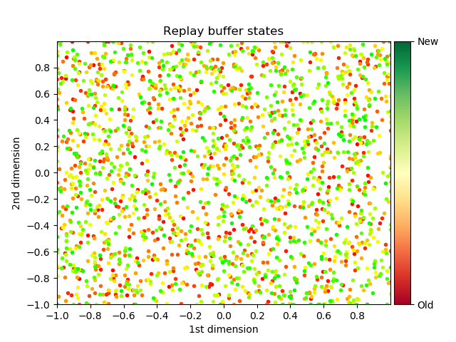
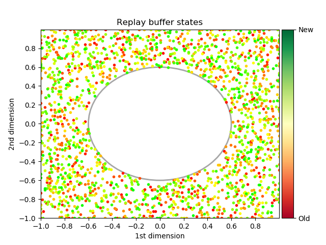
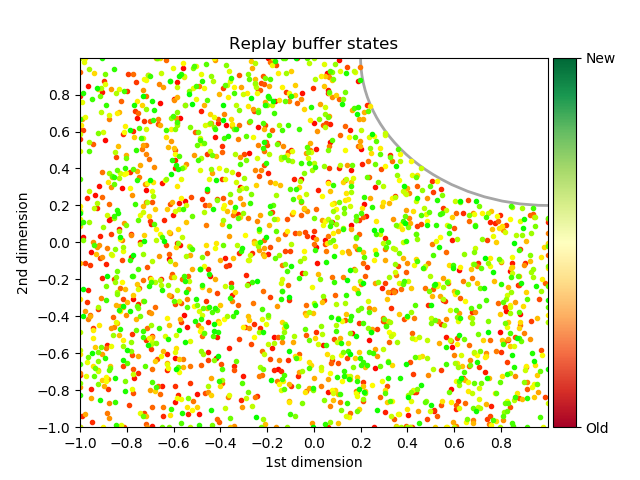
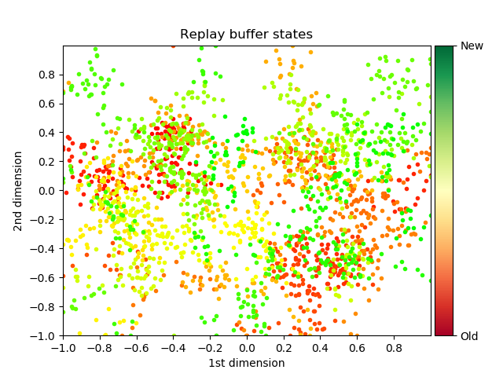
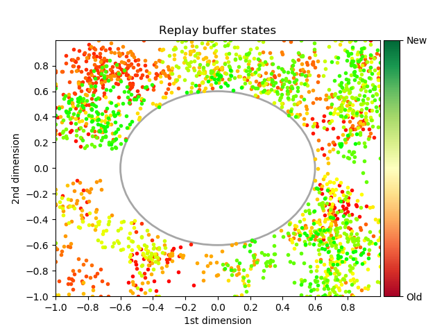
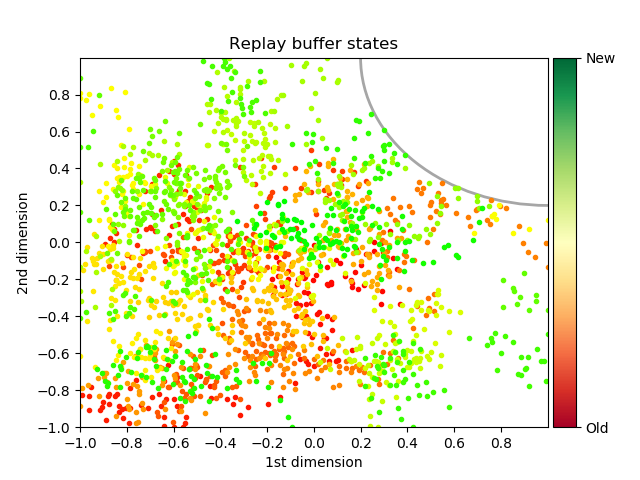

Study 2: Filtered replay buffer
--------

In this study, we analyse the influence of a filtered replay buffer on
the performances of DDPG on a 2 dimensional environment in order to test
the limits of function approximators in different environment
configurations [@schaul_universal_2015]. The filter imposes a circular
unexplored region in the environment. The flag $--no_new_exp$ is set for
the whole study.

Several configurations are studied, where we act on the filter position
and size while using different exploration schemes. For each of them the
learning timesteps parameter is set to 100k, on a replay buffer that can
contain up to 4096 steps.

The environment being 2 dimensional where each dimension $d\in[-1,1]$,
we can visualize the content of a replay buffer to see the explored
regions with the different exploration schemes and filter positions.

 |  | 
|----------|-----------|-----------|
 |  | 

\[fig:filter\_random\_walk\]

The exploration mode should play a critical role in the convergence
rate, as the random walk exploration will explore a smaller portion of
the environment than the uniform one on average. This phenomenon is more
apparent as fewer experiences are sampled. Intuitively, the size of the
filter should also influence the performance as DDPG will be required to
interpolate or extrapolate (depending on the filter position) in order
to converge to the optimal policy.

The filter that we use is circular, with $\theta$ the center of the
filter, $r$ its radius and $x$ a point in the n dimensional space the
indicator function that we use to know if a point is in the filter is:

    

Therefore, we do allow points that are lying on the filter boundary.

We will compare the resulting policies to the optimal policy shown in
Figure \[fig:theoretical\_policy\] and evaluate how the learned policy
deviates from it for several key size and positions of filter.

### Uniform exploration and centered filter

This study focuses on the behaviour of DDPG on a replay buffer with
uniform exploration and a center filter with a radius ranging from 0 (no
filter) to 1.2

Parameters for this experiment:

-   `--learning_timesteps=100k`

-   `--eval_freq=5k`

-   `--exploration_mode="uniform"`

-   `--buffer_size=4096`

-   `--exploration_timesteps=4096`

-   `--filter_position=0`

-   `--filter_size=0, 0.2, 0.4, 0.6, 0.8, 1, 1.2`

![center filter with uniform exploration[]{data-label="fig:center_curves_uniform"}](../../report/Study_2/2.1/visualizations/scores_filter_size.png "fig:") | ![center filter with uniform exploration[]{data-label="fig:center_curves_uniform"}](../../report/Study_2/2.1/visualizations/total_scores.png "fig:")
|----------|------------|

In Figure \[fig:center\_curves\_uniform\] we cannot see any significant
difference on the performance achieved according to the filter size. It
is however important to present the resulting $Q(s, \Pi(s))$ for some
filter size value to understand how DDPG adapted to the presence of the
filter. Please note that the $\Pi(s)$ visualizations are not included as
they were all optimal.

![Sample policies: center filter with uniform exploration[]{data-label="fig:center_contour_uniform"}](../../report/Study_2/2.1/visualizations/Q_contour_0_4.png "fig:") | ![Sample policies: center filter with uniform exploration[]{data-label="fig:center_contour_uniform"}](../../report/Study_2/2.1/visualizations/Q_contour_0_8.png "fig:") | ![Sample policies: center filter with uniform exploration[]{data-label="fig:center_contour_uniform"}](../../report/Study_2/2.1/visualizations/Q_contour_1_2.png "fig:")
|-----------|------------|-----------|

DDPG with a uniform exploration is able to converge even when a
significant proportion of the environment is left unexplored due to a
centered filter. The estimated Q values seem to increase proportionally
to the filter size, but there is no evidence to conclude that a
divergent behaviour took place during the learning process.

We can clearly see that the centered filter had an effect on the learned
policy in Figure \[fig:center\_contour\_uniform\] by comparing this
result with Figure \[fig:64k\_policy\] but this effect did not impact
the performance. Mostly because of the simplicity of the environment and
the independence of each dimensions with respect to the others.

### Random walk exploration and centered filter

This study focuses on the behaviour of DDPG on a replay buffer with
random walk exploration and a center filter with a radius ranging from 0
(no filter) to 1.2

Parameters for this experiment:

-   `--learning_timesteps=100k`

-   `--eval_freq=5k`

-   `--exploration_mode="random_walk"`

-   `--buffer_size=4096`

-   `--exploration_timesteps=4096`

-   `--filter_position=0`

-   `--filter_size=0, 0.2, 0.4, 0.6, 0.8, 1, 1.2`

![Center filter with random walk exploration[]{data-label="fig:center_curves_random_walk"}](../../report/Study_2/2.2/visualizations/scores_filter_size.png "fig:") | ![Center filter with random walk exploration[]{data-label="fig:center_curves_random_walk"}](../../report/Study_2/2.2/visualizations/total_scores.png "fig:")
|----------|-----------|

The result are very similar to the previous case where no significant
performance drop can be observed in Figure
\[fig:center\_curves\_random\_walk\].

![Sample policies : center filter with random walk exploration[]{data-label="fig:center_contour_random_walk"}](../../report/Study_2/2.2/visualizations/Q_contour_0_4.png "fig:") | ![Sample policies : center filter with random walk exploration[]{data-label="fig:center_contour_random_walk"}](../../report/Study_2/2.2/visualizations/Q_contour_0_8.png "fig:") | ![Sample policies : center filter with random walk exploration[]{data-label="fig:center_contour_random_walk"}](../../report/Study_2/2.2/visualizations/Q_contour_1_2.png "fig:")
|-------------|-----------|----------|

Figure \[fig:center\_contour\_random\_walk\] show us the resulting
$Q(s, \Pi(s))$ for the same sample filter size value. Almost no
difference with the uniform exploration can be observed as the number of
experiences is above the threshold seen in study 1.

### Uniform exploration and cornered filter

This study focuses on the behaviour of DDPG on a replay buffer with
uniform exploration and a filter in the top right corner with a radius
ranging from 0 (no filter) to 2.2. As the filter is now in the corner
covering the most rewarding spot in the environment one could expect a
drop in performance proportional to the filter size since it will mask a
significant proportion of high rewarding positions to DDPG.

Parameters for this experiment:

-   `--learning_timesteps=100k`

-   `--eval_freq=5k`

-   `--exploration_mode="uniform"`

-   `--buffer_size=4096`

-   `--exploration_timesteps=4096`

-   `--filter_position=1`

-   `--filter_size=0.4, 0.8, 1.2, 1.6, 2, 2.2`

![corner filter with uniform exploration[]{data-label="fig:corner_curves_uniform"}](../../report/Study_2/2.3/visualizations/scores_filter_size.png "fig:") | ![corner filter with uniform exploration[]{data-label="fig:corner_curves_uniform"}](../../report/Study_2/2.3/visualizations/total_scores.png "fig:")
|-----------|------------|

We can observe the expected performance drop in Figure
\[fig:corner\_curves\_uniform\] when the filter size exceeds 2.0 while
the sizes below do not seem to affect the performance in any significant
way.

![Sample policies : corner filter with uniform exploration[]{data-label="fig:corner_contour_uniform"}](../../report/Study_2/2.3/visualizations/Q_contour_0_4.png "fig:") | ![Sample policies : corner filter with uniform exploration[]{data-label="fig:corner_contour_uniform"}](../../report/Study_2/2.3/visualizations/Q_contour_0_8.png "fig:") | ![Sample policies : corner filter with uniform exploration[]{data-label="fig:corner_contour_uniform"}](../../report/Study_2/2.3/visualizations/Q_contour_1_2.png "fig:")
|---------------|--------------|-----------------|
![Sample policies : corner filter with uniform exploration[]{data-label="fig:corner_contour_uniform"}](../../report/Study_2/2.3/visualizations/Q_contour_1_6.png "fig:") | ![Sample policies : corner filter with uniform exploration[]{data-label="fig:corner_contour_uniform"}](../../report/Study_2/2.3/visualizations/Q_contour_2_0.png "fig:") | ![Sample policies : corner filter with uniform exploration[]{data-label="fig:corner_contour_uniform"}](../../report/Study_2/2.3/visualizations/Q_contour_2_2.png "fig:")

In Figure \[fig:corner\_contour\_uniform\] we have the resulting
$Q(s, \Pi(s))$ for each filter size value. As we can see, until the
filter reaches a critical size of 2.0, masking all dimensions boundaries
that would lead to a high reward the Q values estimation are coherent
with what was previously observed.

When the filter radius goes above the 2.0 threshold we do notify that
the Q values estimations tends toward 0 over the observations space. The
performance drop at this point is significant since the actor is only
going on the bottom left corner where the only alternative is a low
reward.

Here are the gradient field visualizations of the actor’s decisions for
the 2.0 and 2.2

![Sample policies : 2.0 and 2.2 radius[]{data-label="samples_policies_uniform_corner"}](../../report/Study_2/2.3/visualizations/Pi_arrow_2_0.png "fig:") | ![Sample policies : 2.0 and 2.2 radius[]{data-label="samples_policies_uniform_corner"}](../../report/Study_2/2.3/visualizations/Pi_arrow_2_2.png "fig:")
|-----------|-----------|

It now becomes clear with Figure \[samples\_policies\_uniform\_corner\]
why the 2.0 and 2.2 radius filters have such different impact on the
performance. The 2.2 filter radius with no high reward samples forced
DDPG to act uniformly in order to reach the bottom left corner where
nothing but a low reward is present.

It would seem that DDPG is not able to extrapolate as well as it can
interpolate Q values estimations over the environment.

### Random walk exploration and cornered filter

This study focuses on the behaviour of DDPG on a replay buffer with
random walk exploration and a filter in the top right corner with a
radius ranging from 0 (no filter) to 2.2.

Parameters for this experiment:

-   `--learning_timesteps=100k`

-   `--eval_freq=5k`

-   `--exploration_mode="random_walk"`

-   `--buffer_size=4096`

-   `--exploration_timesteps=4096`

-   `--filter_position=1`

-   `--filter_size=0.4, 0.8, 1.2, 1.6, 2, 2.2`

![corner filter with random walk exploration[]{data-label="fig:corner_curves_random_walk"}](../../report/Study_2/2.4/visualizations/scores_filter_size.png "fig:") | ![corner filter with random walkexploration[]{data-label="fig:corner_curves_random_walk"}](../../report/Study_2/2.4/visualizations/total_scores.png "fig:")
|------------|-----------|

The same performance drop is clearly present in Figure
\[fig:corner\_curves\_random\_walk\], with the 2.0 and 2.2 radius
filters.

![Sample policies : corner filter with random walk exploration[]{data-label="fig:corner_contour_random_walk"}](../../report/Study_2/2.4/visualizations/Q_contour_0_4.png "fig:") | ![Sample policies : corner filter with random walk exploration[]{data-label="fig:corner_contour_random_walk"}](../../report/Study_2/2.4/visualizations/Q_contour_0_8.png "fig:") | ![Sample policies : corner filter with random walk exploration[]{data-label="fig:corner_contour_random_walk"}](../../report/Study_2/2.4/visualizations/Q_contour_1_2.png "fig:")
|------------|------------|-------------|
![Sample policies : corner filter with random walk exploration[]{data-label="fig:corner_contour_random_walk"}](../../report/Study_2/2.4/visualizations/Q_contour_1_6.png "fig:") | ![Sample policies : corner filter with random walk exploration[]{data-label="fig:corner_contour_random_walk"}](../../report/Study_2/2.4/visualizations/Q_contour_2_0.png "fig:") | ![Sample policies : corner filter with random walk exploration[]{data-label="fig:corner_contour_random_walk"}](../../report/Study_2/2.4/visualizations/Q_contour_2_2.png "fig:")

As we can see in Figure \[fig:corner\_contour\_random\_walk\] the policy
is impacted earlier, around 1.2 a shift is noticeable. The sized above
increase that effect and when the 2.0 radius is used we start noticing
that the Q values estimations are vanishing as in the previous study.

![Sample policies : 1.6, 2.0 and 2.2 radius[]{data-label="fig:sample_policies_corner_sequential"}](../../report/Study_2/2.4/visualizations/Pi_arrow_1_6.png "fig:") | ![Sample policies : 1.6, 2.0 and 2.2 radius[]{data-label="fig:sample_policies_corner_sequential"}](../../report/Study_2/2.4/visualizations/Pi_arrow_2_0.png "fig:") | ![Sample policies : 1.6, 2.0 and 2.2 radius[]{data-label="fig:sample_policies_corner_sequential"}](../../report/Study_2/2.4/visualizations/Pi_arrow_2_2.png "fig:")
|---------------|------------------|----------------|

In Figure \[fig:sample\_policies\_corner\_sequential\] the 1.6 radius
filter visualizations show again a gap between the Actor and the Critic
representation of the observation space. On the 2.0 and 2.2 filter size
have their actions directed to the bottom left corner where only the low
reward is present which explains the lower score. Those approximations
errors might be reduced by using an algorithm reducing the
approximations errors such as TD3 [@fujimoto_addressing_2018].
