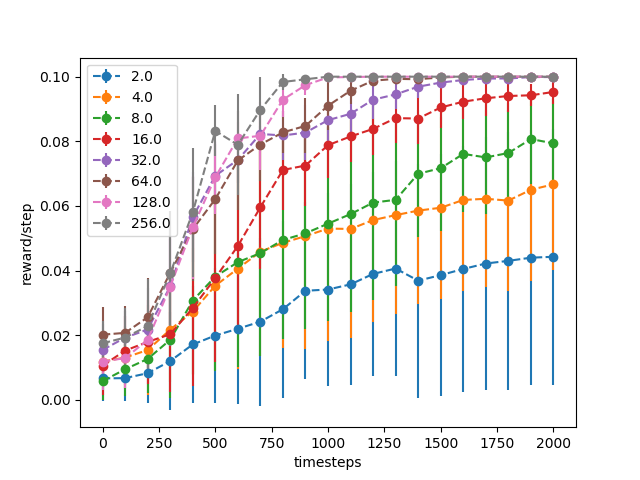
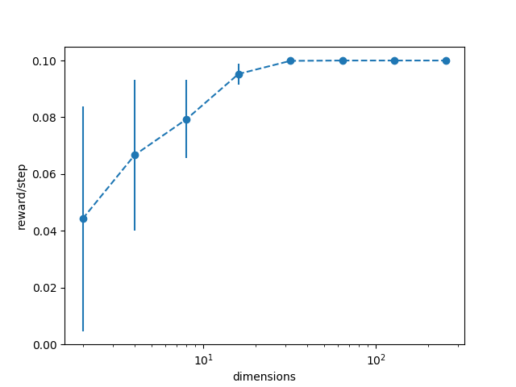
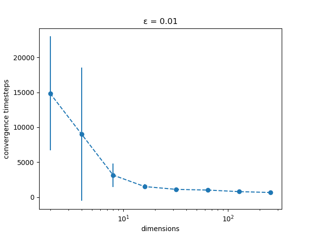
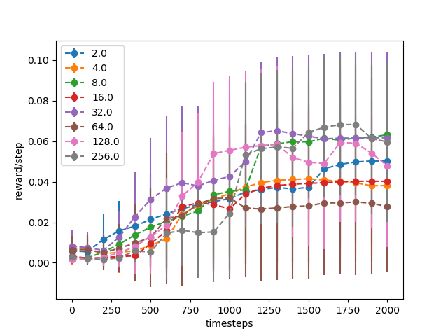
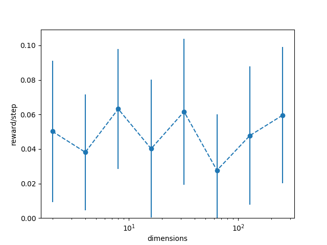

# Study 3: score according to the number of dimensions

In this study we analyze the influence of the number of dimensions on the average reward/step and on the overall performances of a DDPG agent in our environment.

## With one high and one low reward on each dimensions

In this study we will test DDPG according to the number of dimensions in the environment. This test runs on environment with high and low rewards on each dimensions, for example figures \ref{fig:1d_env} and figure \ref{fig:2d_2_env} respects this constraint, on the contrary to figure \ref{fig:2d_1_env} which has no rewards on the second dimension.

We first ran this study and found that the more dimensions the better the agent was doing. This could be explained by the fact that if every dimension has a high and low reward on its boundaries, when the environment is reset, there is an increasing chance that the agent is already close to a high reward. To counter this problem we introduced a parameter to contain the starting position in a circle centered in the environment.

As we can see the convergence rate seems to increase with the number of dimensions, and the standard deviation decrease. As DDPG starts evolving in the environment chances are it will reach a high reward on at least one dimension. The gradient towards this dimension will increase so that it can be exploited. As the process repeats and the number of dimensions increases, The number of dimensions that can be exploited also increases improving the convergence rate, this gives the agent more axis of movement towards a high reward. As there are n / 2 high reward , with an increasing n , the agent expected time to reach a high rewards is stabilized which leads to very low standard deviation.

Figure \ref{fig:convergence} shows the average timesteps needed to reach the optimal policy according the the number of dimensions of the environment. The policy is considered as optimal when the agent reach a score of $ 0.1 - \epsilon $ rewards per step.

## With one high and one low reward on the first dimensions only

This study is the same as the previous one, except that we put only one high and low reward on the first dimension, and all the other dimensions doesn't contains any rewards. For example this two environments figure \ref{fig:1d_env} and figure \ref{fig:2d_1_env} respects this constraint, on the contrary to figure \ref{fig:2d_2_env} which has rewards on the second dimension. We decided to do this study to verify if the result of previous study is due to the fact that the number of rewards increases with the number of dimensions. We will see if a lot of dimensions and only rewards on the first dimension makes the learning harder or not.

Figure \ref{fig:curves_dimensions_one} shows the performances achieved during the whole learning process per dimension. As we can see the convergence rate seems to stay stable with the number of dimensions, but with a very high standard deviation. So it seems to mean that the number of dimensions doesn't affect the ability of DDPG to learn the policy on the important dimension. Since all the dimensions are independents, DDPG can rely only on the single rewarding dimension in order to achieve the highest rewarding goal.
